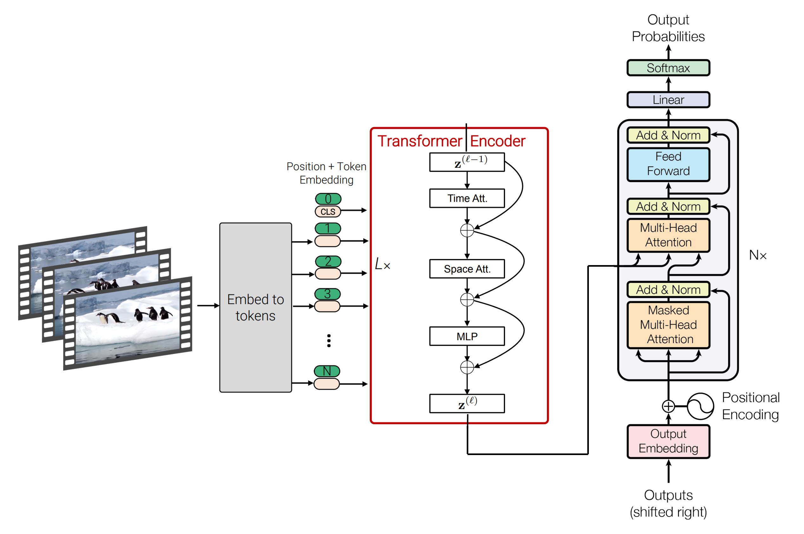

<h1 align='center'> SpaceTimeGPT - Video Captioning Model </h1>

  
  
  
 (partial diagrams from <a href="https://arxiv.org/abs/2103.15691">1</a>, <a href="https://arxiv.org/abs/2102.05095">2</a>, <a href="https://arxiv.org/abs/1706.03762">3</a>) 

SpaceTimeGPT is a video description generation model capable of spatial and temporal reasoning. Given a video, eight frames are sampled and analyzed by the model. The output is a sentence description of the events that occured in the video, generated using autoregression.

## Architecture and Training
Video Encoder: [TimeSformer](https://ai.meta.com/blog/timesformer-a-new-architecture-for-video-understanding/)

Text Decoder: [GPT 2](https://openai.com/index/better-language-models/)

The encoder and decoder are initialized using pretrained weights for video classification and sentence completion, respectively. Encoder-decoder cross attention is used to unify the visual and linguistic domains. The model is fine-tuned end-to-end on the video captioning task.

## Dataset and Evaluation
SpaceTimeGPT is trained on [VATEX](https://eric-xw.github.io/vatex-website/index.html), a large video captioning dataset.

Performance: 67.3 [CIDEr](https://github.com/ramavedantam/cider) on the VATEX test split

Sampling method: 30 $\le$ generated tokens $\le$ 60, beam search with 8 beams

## Usage and Project Files
The easiest way to inference the model is through its [Hugging Face checkpoint](https://huggingface.co/Neleac/timesformer-gpt2-video-captioning).

Alternatively, you may create your own dataset and train the model using the files provided:

* src
  * process_data - create Hugging Face Dataset using video and caption files
  * train - perform training
  * inference - perform inference
* dataset
  * vatex_{split} - VATEX {split} video IDs and captions
  * videoID_captions - all video IDs and captions
* result
  * generated_captions - model output on VATEX test split
  * vatex_test_cider - ground-truth captions of VATEX test split, in CIDEr format
* vatex_utils - utility scripts for acquiring and processing VATEX data
